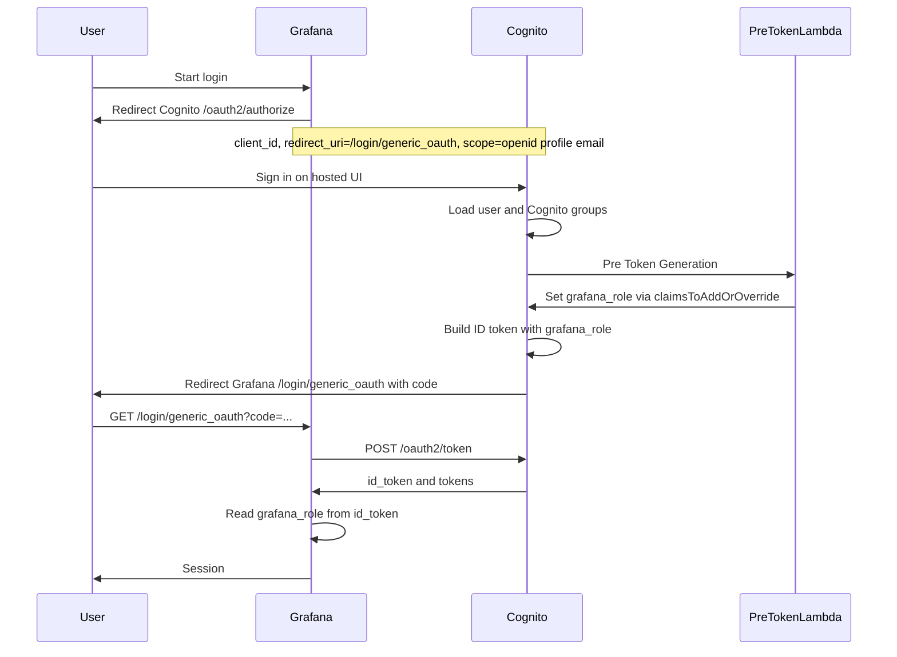
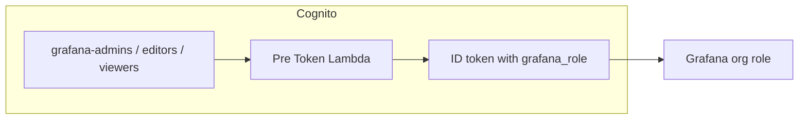
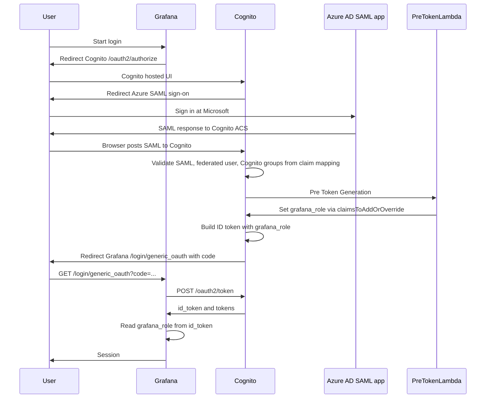
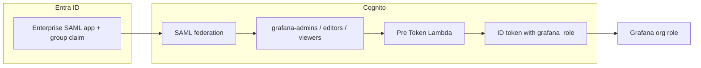

# grafana_cognito

Terraform stack that runs **Grafana on ECS** behind an **Application Load Balancer** with **HTTPS** (ACM), **Route 53**, and **Cognito SSO** with RBAC. Persistent storage on EFS.

## What it does

- **ECS**: One task definition (single Grafana container, 512 CPU / 1024 MiB). Service runs in your existing EC2-type ECS cluster, in private subnets. Container runs as non-root (UID 472). ECS Exec enabled for debugging when the cluster supports it.
- **ALB**: HTTPS listener on 443 (existing ACM cert); HTTP on 80 redirects to HTTPS. Health checks use Grafana’s `/api/health` (HTTP 200).
- **Route 53**: Creates an A alias record in an existing hosted zone pointing at the ALB. Set `route53_zone_id` and `route53_record_name`; the zone must already exist.
- **Cognito SSO**: Cognito User Pool as OIDC provider; Grafana uses Generic OAuth. **RBAC**: A Pre Token Generation Lambda injects `grafana_role` (Admin/Editor/Viewer) from Cognito groups `grafana-admins`, `grafana-editors`, `grafana-viewers`. Users not in any of these groups are denied login (strict mode).
- **EFS**: Grafana’s data lives on EFS at `/grafana-data`. SQLite DB, dashboards, plugins, logs, and provisioning dirs persist across task replacement.
- **Secrets**: Optional admin password and Cognito app client secret in SSM Parameter Store (SecureString), injected at runtime. Leave admin password unset for default admin/admin; local login can be kept as fallback or disabled.
- **Logs**: Container logs go to CloudWatch (`/ecs/{environment}-grafana`).
- **Network**: ALB ingress (80 and 443) from deployer IP or `alb_ingress_cidrs`; tasks accept traffic only from the ALB; EFS accepts NFS only from the task security group.

**SQLite on EFS:** Single ECS task, one writer. For multiple instances or stronger durability, use an external DB (e.g. RDS).

**Persistence:** Dashboards and config are stored in the Grafana DB on EFS. Creating a dashboard and then restarting the service keeps the dashboard.

## Auth process

Grafana uses **Generic OAuth** against Cognito. The browser gets a redirect to Cognito, then back with an **authorization code**. Grafana exchanges the code for tokens on the server.

Cognito runs a **Pre Token Generation** Lambda before issuing the **ID token**. The Lambda reads the user’s Cognito groups and writes one claim, **`grafana_role`**, using `claimsToAddOrOverride`. Grafana reads **`grafana_role`** from the ID token and maps it to its org role. **Strict mode** rejects logins when **`grafana_role`** is empty.

**Group → role (one row per group):**

| Cognito group | `grafana_role` in ID token | Grafana org role |
| --- | --- | --- |
| `grafana-admins` | `Admin` | Admin |
| `grafana-editors` | `Editor` | Editor |
| `grafana-viewers` | `Viewer` | Viewer |

### Cognito only (no Azure)



| Step | What |
| --- | --- |
| 1 | Grafana redirects the browser to Cognito `/oauth2/authorize` with the OAuth client and scopes. |
| 2 | User signs in on the Cognito hosted UI. |
| 3 | Cognito loads the user’s Cognito group membership. |
| 4 | Cognito invokes the Pre Token Lambda. The Lambda sets **`grafana_role`** from the table above. |
| 5 | Cognito issues the ID token containing **`grafana_role`** and redirects to Grafana with the **`code`**. |
| 6 | Grafana calls **`POST /oauth2/token`** with the **`code`** and client secret. |
| 7 | Grafana reads **`grafana_role`** from the **`id_token`** and opens a session. |



Strict mode denies login when **`grafana_role`** is missing on the token.

### Cognito + Azure AD (Enterprise app, SAML)

Grafana still uses **only** Cognito for OAuth. Azure is a **SAML IdP** on the Cognito user pool. After Microsoft sign-in, Cognito continues with the same Pre Token Lambda and **`grafana_role`** flow as above.

SAML **group claims** from Azure map to Cognito group membership (**`grafana-admins`**, **`grafana-editors`**, **`grafana-viewers`**). The Pre Token Lambda uses that membership and the same **`grafana_role`** table as above.

This Terraform stack does not create the Azure enterprise app or the SAML IdP in Cognito.



| Step | What |
| --- | --- |
| 1 | Grafana redirects to Cognito `/oauth2/authorize`. |
| 2 | Cognito redirects the browser to the Azure enterprise app SAML sign-on. |
| 3 | User signs in at Microsoft. Azure returns a SAML response to Cognito. |
| 4 | Cognito validates SAML and sets Cognito groups from the mapped group claim. |
| 5 | Cognito invokes the Pre Token Lambda. The Lambda sets **`grafana_role`** from the table above. |
| 6 | Cognito issues the ID token containing **`grafana_role`** and redirects to Grafana with the **`code`**. |
| 7 | Grafana **`POST /oauth2/token`** with the **`code`** and client secret. |
| 8 | Grafana reads **`grafana_role`** from the **`id_token`** and opens a session. |



Strict mode denies login when **`grafana_role`** is missing on the token.

Docs: [Cognito SAML IdP](https://docs.aws.amazon.com/cognito/latest/developerguide/cognito-user-pools-saml-idp.html), [Entra enterprise apps](https://learn.microsoft.com/en-us/entra/identity/applications-apps-how-managed).

## Prerequisites

- ECS cluster (EC2 launch type).
- VPC with at least two **private** subnets (for tasks and EFS mount targets) and two **public** subnets (for the ALB).
- **ACM certificate** in the same region as the ALB; cert must cover the Route 53 record name (e.g. grafana.example.com).
- **Route 53 hosted zone** (existing); this stack creates only the A record.

## Apply

```bash
cp terraform.tfvars.example terraform.tfvars
# Set: ecs_cluster_arn, vpc_id, private_subnet_ids, public_subnet_ids, acm_certificate_arn, route53_zone_id, route53_record_name

terraform init
terraform apply
```

## After apply

- **URL**: Use the `web_url` output. Sign in via **Login with Cognito** (or use local admin if `grafana_admin_password` is set and login form is enabled).
- **Cognito**: Create users in the user pool (console, CLI, or Terraform). Add each user to one of `grafana-admins`, `grafana-editors`, or `grafana-viewers` for RBAC. Outputs `cognito_user_pool_id`, `cognito_user_pool_domain`, and `cognito_app_client_id` for reference.

### Creating users (optional)

Set the `cognito_users` variable; Terraform creates each user, adds them to the specified group, and Cognito sends a welcome email with a temporary password.

Example (see `terraform.tfvars.example`):

```hcl
cognito_users = {
  "grafana-admins"  = [{ email = "admin@example.com", name = "Admin User" }]
  "grafana-editors" = [{ email = "editor@example.com" }]
  "grafana-viewers" = [{ email = "viewer@example.com", name = "Viewer" }]
}
```

- **Logs**: `log_group_grafana` output gives the CloudWatch log group name.
- **EFS**: `efs_id` is the file system ID; use it for backup/restore of the Grafana data path if needed.
